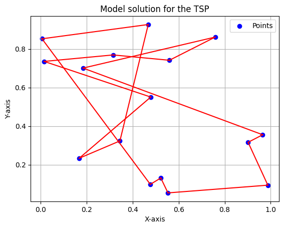

# About

This is the codebase for the AMLD **Introduction to Reinforcement Learning with applications to
satellite scheduling problems**.

# Installation

Start by cloning the repository by running:

```
https://github.com/TheoLeFur/AMLD.git
```

Enter the project directory and create your virtual environment:

```
conda create -n your_env_name
```

Install the dependencies using:

```
conda install --file requirements.txt
```

Setup the project using
```
pip3 install -e .
```

# Neural Combinatorial Optimisation

We will give a basic implementation of a neural network architecture, trained with Policy Gradients, to solve combinatorial optimization problems. In our case, we will show how the model performs on the Travelling Salesman Problem, an NP hard problem $\theta(n^2 2^n)$. We will be following the paper shared in the ressources.

## Exercice

Fill in the TODOs in <code>combinatorial_rl.py</code>. Then, from the <code>amld_rl</code>, start running
the training script:

```
python3 run_cbrl_train.py
```

One can see here a sample solution, for a model trained on 500000 random graphs, each having 16 nodes:


# Ressources

[Neural Combinatorial Optimization with Reinforcement Learning](https://arxiv.org/pdf/1611.09940.pdf)

[Policy Gradient Methods for Reinforcement Learning with Function Approximation](https://proceedings.neurips.cc/paper/1999/file/464d828b85b0bed98e80ade0a5c43b0f-Paper.pdf)
